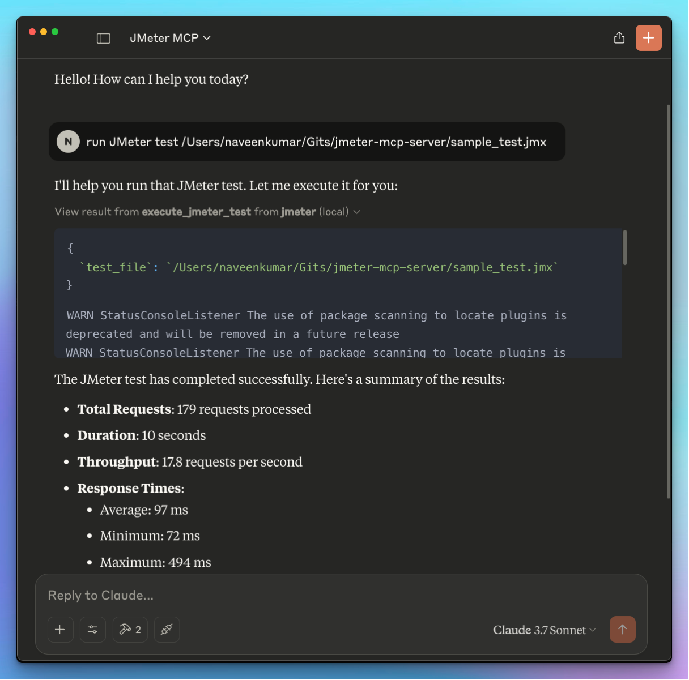
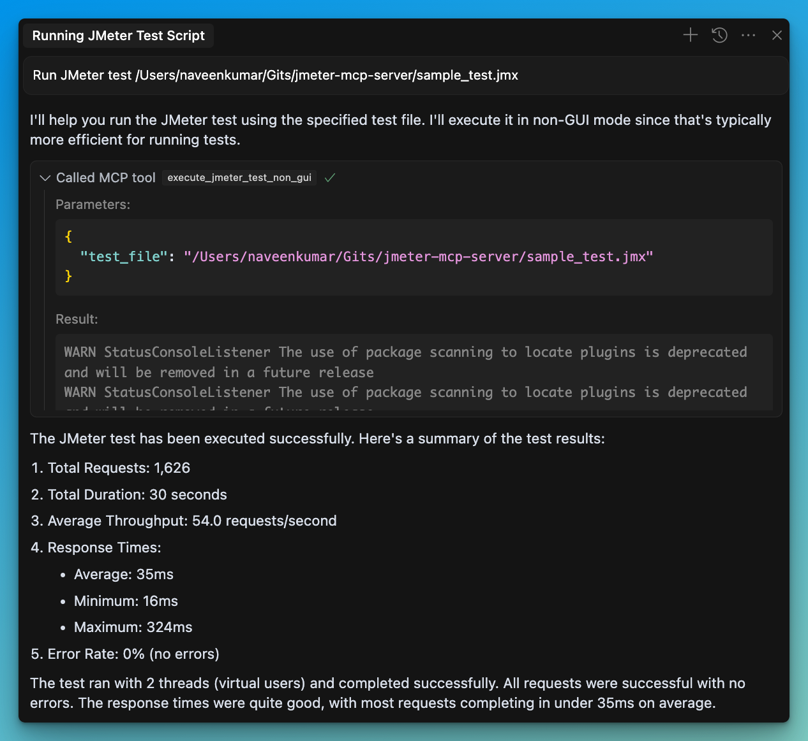
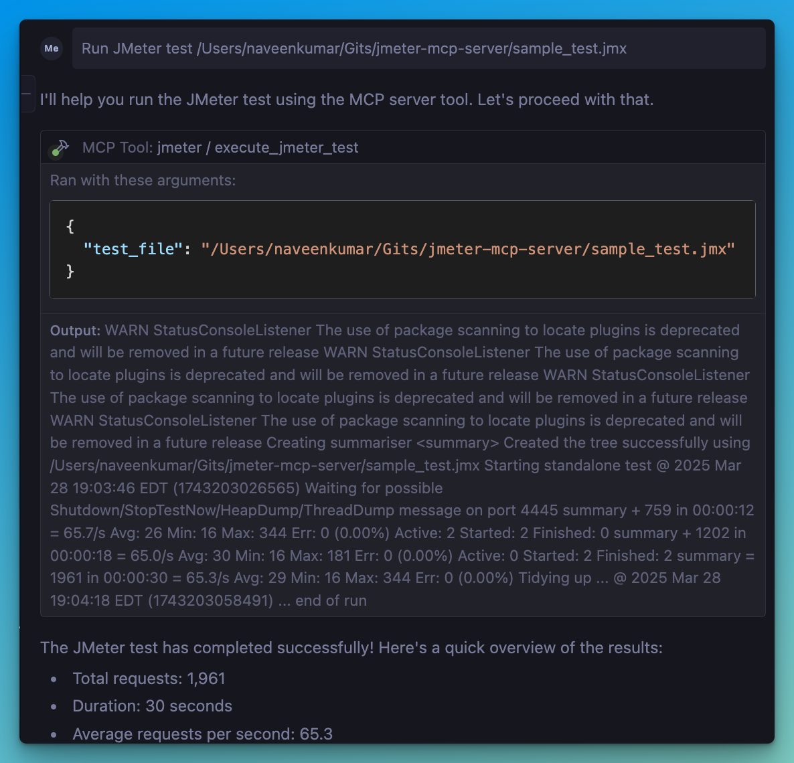

# 🚀 JMeter MCP Server
[](https://archestra.ai/mcp-catalog/qainsights__jmeter-mcp-server)

This is a Model Context Protocol (MCP) server that allows executing JMeter tests through MCP-compatible clients and analyzing test results.

> [!IMPORTANT]
> 📢 Looking for an AI Assistant inside JMeter? 🚀
> Check out [Feather Wand](https://jmeter.ai)





## 📋 Features

### JMeter Execution
- 📊 Execute JMeter tests in non-GUI mode
- 🖥️ Launch JMeter in GUI mode
- 📝 Capture and return execution output
- 📊 Generate JMeter report dashboard

### Test Results Analysis
- 📈 Parse and analyze JMeter test results (JTL files)
- 📊 Calculate comprehensive performance metrics
- 🔍 Identify performance bottlenecks automatically
- 💡 Generate actionable insights and recommendations
- 📊 Create visualizations of test results
- 📑 Generate HTML reports with analysis results

## 🛠️ Installation

### Local Installation

1. Install [`uv`](https://github.com/astral-sh/uv):

2. Ensure JMeter is installed on your system and accessible via the command line.

⚠️ **Important**: Make sure JMeter is executable. You can do this by running:

```bash
chmod +x /path/to/jmeter/bin/jmeter
```

3. Install required Python dependencies:

```bash
pip install -r requirements.txt
```

4. Configure the `.env` file, refer to the `.env.example` file for details.

```bash
# JMeter Configuration
JMETER_HOME=/path/to/apache-jmeter-5.6.3
JMETER_BIN=${JMETER_HOME}/bin/jmeter

# Optional: JMeter Java options
JMETER_JAVA_OPTS="-Xms1g -Xmx2g"
```

### 💻 MCP Usage

1. Connect to the server using an MCP-compatible client (e.g., Claude Desktop, Cursor, Windsurf)

2. Send a prompt to the server:

```
Run JMeter test /path/to/test.jmx
```

3. MCP compatible client will use the available tools:

#### JMeter Execution Tools
- 🖥️ `execute_jmeter_test`: Launches JMeter in GUI mode, but doesn't execute test as per the JMeter design
- 🚀 `execute_jmeter_test_non_gui`: Execute a JMeter test in non-GUI mode (default mode for better performance)

#### Test Results Analysis Tools
- 📊 `analyze_jmeter_results`: Analyze JMeter test results and provide a summary of key metrics and insights
- 🔍 `identify_performance_bottlenecks`: Identify performance bottlenecks in JMeter test results
- 💡 `get_performance_insights`: Get insights and recommendations for improving performance
- 📈 `generate_visualization`: Generate visualizations of JMeter test results

## 🏗️ MCP Configuration

Add the following configuration to your MCP client config:

```json
{
    "mcpServers": {
      "jmeter": {
        "command": "/path/to/uv",
        "args": [
          "--directory",
          "/path/to/jmeter-mcp-server",
          "run",
          "jmeter_server.py"
        ]
      }
    }
}
```

## ✨ Use Cases

### Test Execution
- Run JMeter tests in non-GUI mode for better performance
- Launch JMeter in GUI mode for test development
- Generate JMeter report dashboards

### Test Results Analysis
- Analyze JTL files to understand performance characteristics
- Identify performance bottlenecks and their severity
- Get actionable recommendations for performance improvements
- Generate visualizations for better understanding of results
- Create comprehensive HTML reports for sharing with stakeholders

## 🛑 Error Handling

The server will:

- Validate that the test file exists
- Check that the file has a .jmx extension
- Validate that JTL files exist and have valid formats
- Capture and return any execution or analysis errors

## 📊 Test Results Analyzer

The Test Results Analyzer is a powerful feature that helps you understand your JMeter test results better. It consists of several components:

### Parser Module
- Supports both XML and CSV JTL formats
- Efficiently processes large files with streaming parsers
- Validates file formats and handles errors gracefully

### Metrics Calculator
- Calculates overall performance metrics (average, median, percentiles)
- Provides endpoint-specific metrics for detailed analysis
- Generates time series metrics to track performance over time
- Compares metrics with benchmarks for context

### Bottleneck Analyzer
- Identifies slow endpoints based on response times
- Detects error-prone endpoints with high error rates
- Finds response time anomalies and outliers
- Analyzes the impact of concurrency on performance

### Insights Generator
- Provides specific recommendations for addressing bottlenecks
- Analyzes error patterns and suggests solutions
- Generates insights on scaling behavior and capacity limits
- Prioritizes recommendations based on potential impact

### Visualization Engine
- Creates time series graphs showing performance over time
- Generates distribution graphs for response time analysis
- Produces endpoint comparison charts for identifying issues
- Creates comprehensive HTML reports with all analysis results

## 📝 Example Usage

```
# Run a JMeter test and generate a results file
Run JMeter test sample_test.jmx in non-GUI mode and save results to results.jtl

# Analyze the results
Analyze the JMeter test results in results.jtl and provide detailed insights

# Identify bottlenecks
What are the performance bottlenecks in the results.jtl file?

# Get recommendations
What recommendations do you have for improving performance based on results.jtl?

# Generate visualizations
Create a time series graph of response times from results.jtl
```